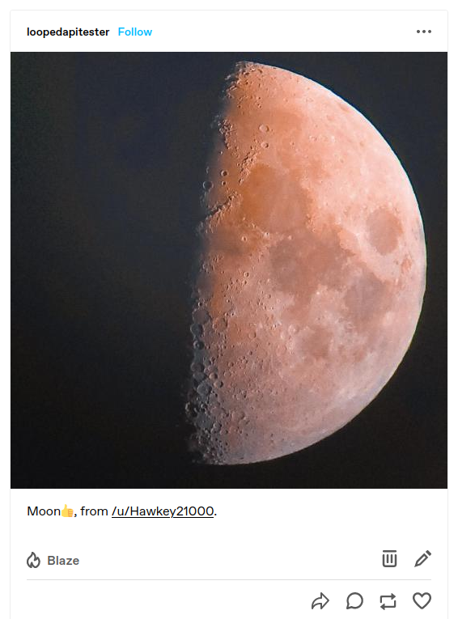

# Reddit To Tumblr

This project provides a simple interface to take the top daily post for a given sub-Reddit and re-post that to a given Tumblr blog. It's designed to run entirely as a daemon which would execute as a `cron` job. Nothing will be built out to follow the normal OAuth process; it assumes the registration of a "personal use script" application for both Reddit and Tumblr. Details on registration are included in the relevant sections below.

Posts made will make a "photo" post to Tumblr with the top image for the day. The caption will include the title of the post along with the username of the original poster on Reddit and a link to the post on Reddit. It will look like:

As this is specifically designed to target posts with images and will fail if the proper attributes aren't present for a Reddit post, an image-centric sub-Reddit should be used as the target. An attempt was made to capture all relevant image formats. If any were missed, please open an issue. Included are:

- `arw`
- `bmp`
- `dip`
- `eps`
- `gif`
- `hei`
- `heif`
- `jfi`
- `jfif`
- `jif`
- `jpe`
- `jpeg`
- `jpg`
- `nrw`
- `png`
- `raw`
- `svg`
- `svgz`
- `tif`
- `tiff`
- `webp`

## Configuration

The following is the information needed to configure the code for both Reddit and Tumblr. Application registration and key generation is outside the scope of this simple little script.

### Reddit

The following environment variables are needed for Reddit. Note that none of these are _actually_ needed at the moment since the information is publicly available. Unless you end up running this **much** more than daily, it's also unlikely to run afoul of any throttles on the Reddit end. That being said, since I built this prior to realizing, I'll pretend it's to be a good steward of Reddit's services and avoid any potential issues in the future. :)

A Reddit client can be registered [here](https://www.reddit.com/prefs/apps). See the [Reddit OAuth2 wiki](https://github.com/reddit-archive/reddit/wiki/OAuth2) for additional details.

- `reddit_sub` - The sub-Reddit to target. Should be just the sub name, e.g. `spaceporn`, not `reddit.com/r/spaceporn`.
- `reddit_client_id`
- `reddit_client_secret`
- `reddit_username`
- `reddit_password`

### Tumblr

The following environment variables are expected for Tumblr. The details can be generated via the [API console](https://api.tumblr.com/console). Unlike the Reddit details, these are needed since a post will be made against the blog specified.

- `tumblr_blog` - The Tumblr blog to post to. E.g. `loopedapitester.tumblr.com`
- `tumblr_key`
- `tumblr_secret`
- `tumblr_oauth_token`
- `tumblr_oauth_secret`

## Automation

It is recommended to run this as a `cron` job which executes daily. Not only will this avoid spamming Tumblr, but the way the code is designed, running it more frequently would be likely to give you the same top daily post multiple times.

